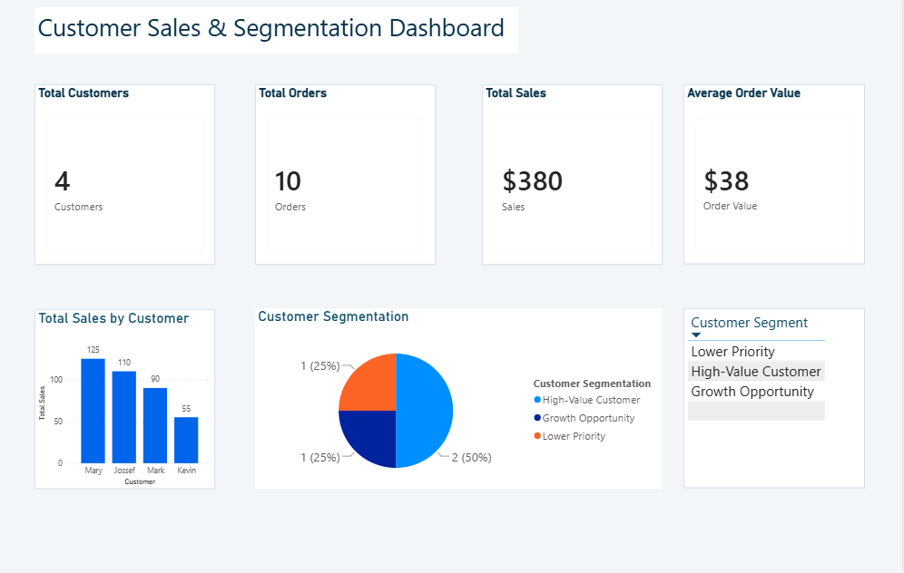

# Customer Sales & Segmentation Analysis

## Project Overview

This project analyzes customer purchasing behavior to identify sales patterns, purchasing frequency, average order value, and customer segments.

The analysis follows an end-to-end data analysis workflow using SQL, Excel, and Power BI.

## Business Questions

1. Who are the top customers by total sales?
2. Who are the most frequent customers?
3. Which customers have the highest Average Order Value?
4. Which customers represent retention or growth opportunities?

## Data Analysis

### SQL

The SQL analysis includes:

- Total sales by customer
- Total orders by customer
- Average Order Value
- Customer ranking
- Customer segmentation
- Sales and order frequency comparisons
- Common Table Expressions (CTEs)
- Window functions
- CASE expressions

### Excel

Excel was used to organize the analytical results and provide supporting business analysis.

The workbook includes:

- Customer-level analysis
- KPI calculations
- Customer segmentation
- Supporting visualizations

### Power BI

Power BI was used to create an interactive dashboard containing:

- Total Customers
- Total Orders
- Total Sales
- Average Order Value
- Total Sales by Customer
- Customer Segmentation
- Customer Segment filtering

## Key Insights

- Mary is the top customer by total sales, with $125 across three orders.
- Mary, Jossef, and Mark account for 85.53% of total sales.
- Mary, Jossef, and Kevin are the most frequent customers, with three orders each.
- Mark has the highest Average Order Value at $90, based on one order.
- Kevin has the lowest Average Order Value at $18, despite having three purchases.
- Purchase frequency does not necessarily indicate customer value.

## Business Recommendations

- Prioritize customer retention for Mary and Jossef.
- Encourage Mark to increase purchase frequency.
- Increase Kevin's Average Order Value through cross-selling, bundles, and targeted offers.
- Monitor customer segments regularly to identify changes in purchasing behavior.

## Power BI Dashboard



## Tools & Technologies

- PostgreSQL
- Excel
- Power BI
- DBeaver

## Project Structure

```text
Customer-Sales-Segmentation/
├── Excel/
│   └── Customer_Analysis.xlsx
├── Images/
│   └── dashboard.png
├── PowerBI/
│   └── Customer_Sales_Segmentation.pbix
└── SQL/
    └── customer_analysis.sql
